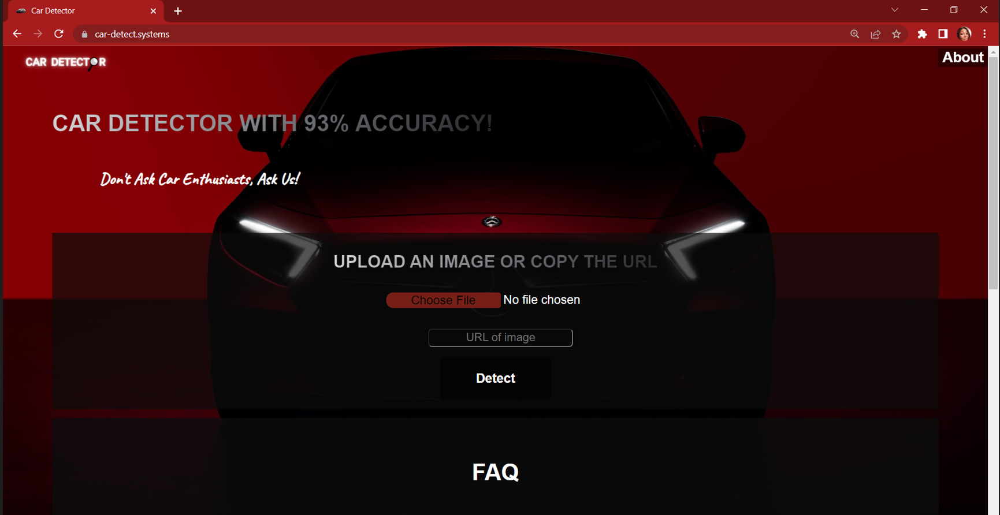
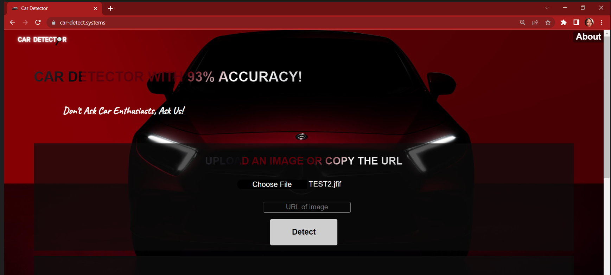
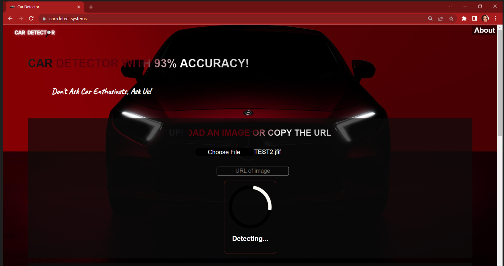
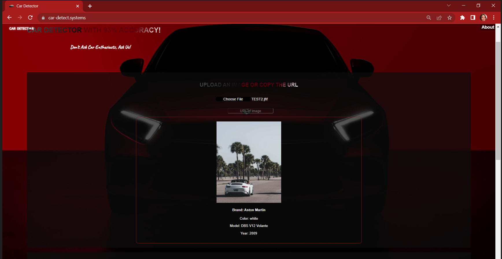
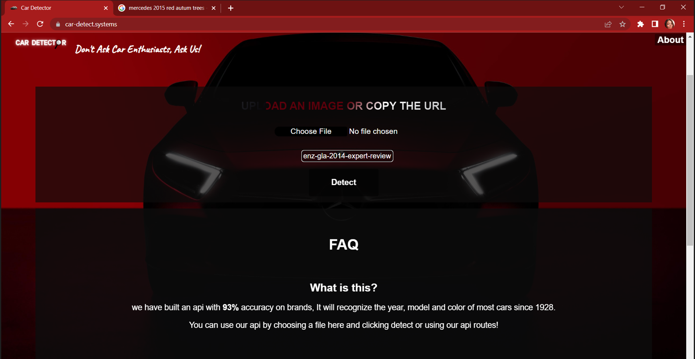
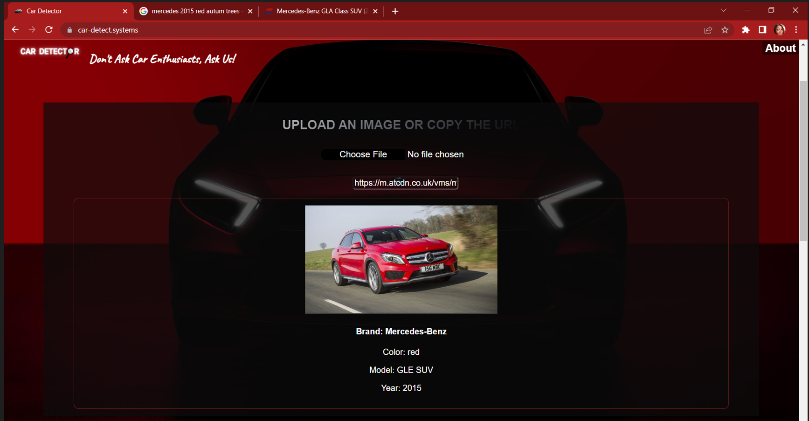
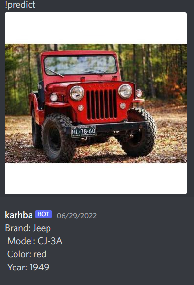
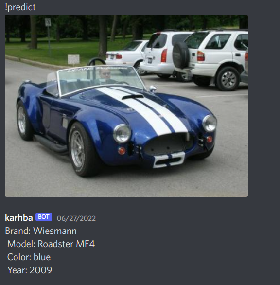

# Car Detector AI API 🚗🔍
 
 

 
## Introduction
 
Welcome to Car Detector our End of Foundation Year Portfolio Project for Holberton School Tunis. It is a web application and a car model classification API using Neural Nets.
 

 
 
## Table of Contents
 
- [The Story](#the-story)
- [Deployed Site](#deployed-site)
- [Blogs](#blogs)
- [Presentation](#presentation)
- [Installation](#installation)
- [Getting Started](#getting-started)
- [Screenshots](#screenshots)
- [Features](#features)
    - [Upload images to API Detect car and return its model, brand, year and color](#features)
    - [GET saved predictions from API via database](#features)
    - [Discord Bot to predict](#features)
- [Built With](#built-with)
- [API](#api)
- [Future](#future)
- [Authors](#authors)
    - [Dhia Ben Dahmani](#dhia-bendahmani)
    - [Rayen Hedri](#rayen-hedri)
    - [Montassar Barbouchi](#montassar-barbouchi)
    - [Mouna Ben Ali](#mouna-benali)
- [Acknowledgments](#acknowledgements)
 
 
## The Story
 
This project started as an idea between Dhia and Rayen when they thought about their childhood and how they used to try to guess the brands of the passing cars in the streets but could not be sure about it. That is how they thought about bringing Car Detector to life.
 
<b>Car Detector</b> is an AI API with 93% accuracy on brands. It will recognize the year, model and color of most cars since 1928. You can use our api by choosing a file and clicking detect or using our api routes!

You can upload a picture of a car(from file or URL), predict its model or brand and display information about it(brand, model, year and color). The team implemented this API with a precise approach that focuses on asynchronous programming and achieving scalability of the project and separating the service into distinct detached sections, so each section addresses a separate concern. With an Agile approach to Project Management that delivers work in small, but consumable, increments.
 
 
Here is our priority objectives:
- Having a simple cli app prototype working on a sample of data(Beta)
- Fetching the new data and cleaning it and retraining the model
- Creating the AI library with a simple class that returns car predictions when initialized with a picture
- Creating a RESTful API  with the library
- ORM with database to save the predictions
- Creating a creative and user-friendly UI with the front-end
- Cleaning the codebase on Github
 
This project will be of great help to users who are looking to identify the brand or model of a particular car, however, it can also be deployed as a component of a surveillance system or a study to identify which cars are more popular. The API can be of service to car enthusiasts, car insurances, car fleet management companies like car dealers or car rentals.
 
 
## Deployed site
[Please visit our Website](https://car-detect.systems/)


 
##  Blogs 
 - [Dhia Ben Dahmani](https://medium.com/@dhiadah/car-detector-a-month-long-journey-ea13d8a8cc36)
 - [Rayen Hedri](#rayen-hedri)
 - [Montassar Barbouchi](#montassar-barbouchi)
 - [Mouna Ben Ali](#mouna-benali)
 
 
##  Presentation 
[Demo Day Presentation](https://docs.google.com/presentation/d/10dEp7BPVkv_gFFCBBhhpVIYzz9P5TSZ05xHUIwR1AKM/edit#slide=id.gf45378fd24_0_9)
 
## Installation
Please clone repo 
```
https://github.com/pfadrm/car_detector.git

```
Check README.md from car_detector/backend/ & car_detector/frontend/cdfe/ for more information

## Getting Started
Access on car-detect.systems and upload a file or a URL and click detect

Do we have a Discord bot?
We actually do! Check it [here](https://discord.com/oauth2/authorize?client_id=991017270878822401&permissions=8&scope=bot)!

Type /predict and attach any number of car images to predict
## Screenshots

- Choose an image file and upload it



- Click Detect



- Detecting


- Check Prediction



- Try it with an image URL



- Check Prediction



- Try our discord Bot






## Features
Main Features of Car Detector:
- Upload images to API Detect car and return its model, brand, year and color
- GET saved predictions from API via database
- Discord Bot to predict

## Built With
* [Res-Net](https://towardsdatascience.com/an-overview-of-resnet-and-its-variants-5281e2f56035) - Machine Learning Neural Network
* [Beautiful Soup](https://www.crummy.com/software/BeautifulSoup/bs4/doc/) - Python library for Web Scraping
* [Flask-RESTful](https://flask-restful.readthedocs.io/en/latest/) - Flask extension for quickly building REST APIs
* [MongoDB](https://www.mongodb.com/) - Document based database for Object Relational Mapper
* [React](https://reactjs.org) - Javascript Library for Front End
* [CSS](https://developer.mozilla.org/en-US/docs/Web/CSS) - Cascading Style Sheets
* [Docker](https://docs.docker.com/) - Docker Compose for deployment
* [Nginx](https://nginx.org/en/docs/) - Web Server
* [Gunicorn](https://docs.gunicorn.org/en/stable/) -  WSGI server

## API ROUTES

The API can be found in car_detector/backend/app/api.py and to use any call, use POSTMAN.

- POST /api/predict
Send an image with the key file or the url with key url on the body of a POST request and you will get prediction in this JSON format:
```
{ "_id": "4d19b7a71f57627144fbb28575d4010c", "img_path": "/static/uploads/images_2.jpeg", "result": { "brand": "Bmw", "model": "3 series sedan", "color": "black", "year": 2015 }
```
- GET /api/prediction?id=
Send id in the GET request parameters and you will get the same response with that id.

## Future
- Multiple car detection
- Car existence verification
- Faster api response with asynchronous programming

## Authors (LinkedIn & Github) :black_nib:
Thanks goes to these wonderful people
 
<!-- ALL-CONTRIBUTORS-LIST:START - Do not remove or modify this section -->
<!-- prettier-ignore-start -->
<!-- markdownlint-disable -->
<table>
  <tr>
    <td align="center"><a href="https://github.com/cryptolake"><br /><sub><b><a href="https://www.linkedin.com/in/dhia-dahmeni-577a42216">Dhia Ben Dahmeni</b></sub></a><br />
    <a href="#blog-AsianCat54x" title="Project Management, Machine Learning Training & DEVOPS">📆</a>
    <a href="#ideas-MatthiasWanner" title="Ideas, Planning, & Feedback">🤔</a>
    <a href="#ideas-MatthiasWanner" title="Code">💻</a>
    <a href="#ideas-MatthiasWanner" title="Test">⚠️</a>
        <a href="#ideas-MatthiasWanner" title="Bugs">🐛</a>
    <a href="#ideas-MatthiasWanner" title="Infrastructure">🚇</a>
    <a href="#ideas-MatthiasWanner" title="Documentation">📖</a>
    <a href="#ideas-MatthiasWanner" title="Blog">📝</a>
    </td>
    <td align="center"><a href="https://github.com/rayenhdr93"><br /><sub><b><a href="https://www.linkedin.com/in/rayen-hedri-61ab5221a/">Rayen Hedri</b></sub></a><br />
    <a href="#ideas-MatthiasWanner" title="Web Scraping & Data Cleaning">🔣</a>
    <a href="#ideas-MatthiasWanner" title="Code">💻</a>
    <a href="#ideas-MatthiasWanner" title="Test">⚠️</a>
        <a href="#ideas-MatthiasWanner" title="Bugs">🐛</a>
    <a href="#ideas-MatthiasWanner" title="Documentation">📖</a>
    <a href="#ideas-MatthiasWanner" title="Blog">📝</a>
    </td>
    <td align="center"><a href="https://github.com/MounaBenAli"><br /><sub><b><a href="https://www.linkedin.com/in/mouna-ben-ali-643bb865/">Mouna Ben Ali</b></sub></a><br />
    <a href="#ideas-MatthiasWanner" title="Back-End">💻</a>
    <a href="#ideas-MatthiasWanner" title="Test">⚠️</a>
    <a href="#ideas-MatthiasWanner" title="Bugs">🐛</a>
    <a href="#ideas-MatthiasWanner" title="Design">🎨</a>
    <a href="#ideas-MatthiasWanner" title="Documentation">📖</a>
    <a href="#ideas-MatthiasWanner" title="Blog">📝</a>
    </td>
    <td align="center"><a href="https://github.com/MontassarBar"><br /><sub><b><a href="https://www.linkedin.com/in/montassar-barbouchi-391b6b220/">Montassar Barbouchi</b></sub></a><br />
    <a href="#ideas-MatthiasWanner" title="Front-End">🎨</a>
    <a href="#ideas-MatthiasWanner" title="Code">💻</a>
    <a href="#ideas-MatthiasWanner" title="Test">⚠️</a>
        <a href="#ideas-MatthiasWanner" title="Bugs">🐛</a>
    <a href="#ideas-MatthiasWanner" title="Documentation">📖</a>
    <a href="#ideas-MatthiasWanner" title="Blog">📝</a>
    </td>
  </tr>
</table>
 
<!-- markdownlint-restore -->
<!-- prettier-ignore-end -->
 
<!-- ALL-CONTRIBUTORS-LIST:END -->
 
 ## Acknowledgments
 * [Holberton School](https://www.holbertonschool.com/) (Staff and Students)
 * [Ahmed Belhaj](https://github.com/Theemiss) (Our Foundation Year Mentor)
 
 
 
 
 
 
 

